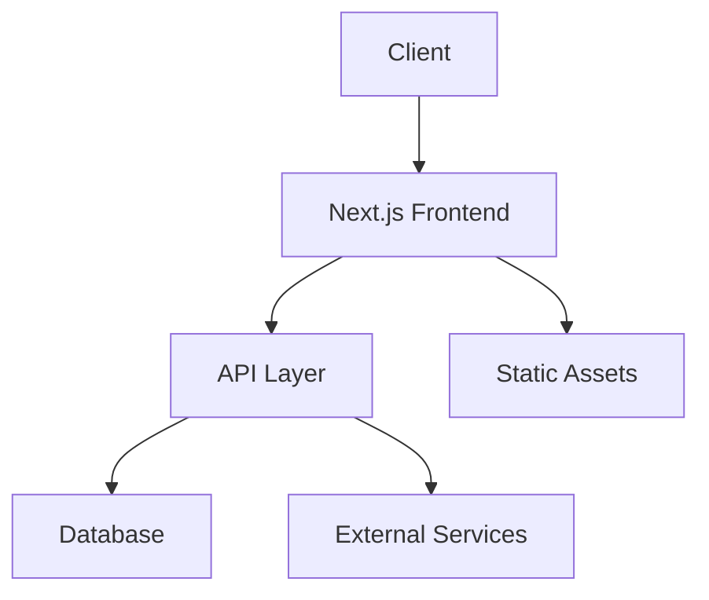

# Architecture Documentation

## Navigation

- [← Back to Main](../README.md)
- [↑ Up to Index](./index.md)
- [→ Next: Frontend Architecture](./frontend.md)

## Contents

1. [Architecture Overview](./overview.md)
   - System Design
   - Technology Stack
   - Design Patterns
   - Infrastructure

2. [Frontend Architecture](./frontend.md)
   - React Components
   - State Management
   - Routing System
   - Performance Optimization

3. [Backend Architecture](./backend.md)
   - API Design
   - Authentication Flow
   - Data Processing
   - Service Integration

4. [Database Architecture](./database.md)
   - Schema Design
   - Data Models
   - Relationships
   - Optimization

## System Overview



## Quick Links

- [Development Guide](../guides/development.md)
- [API Documentation](../api/overview.md)
- [Security Overview](../security/overview.md)

## Key Technologies

### Frontend
- Next.js 13.5.1
- React 18.2.0
- TypeScript
- Tailwind CSS

### Backend
- Node.js
- Supabase
- PostgreSQL
- Redis

### Infrastructure
- Vercel
- Docker
- GitHub Actions
- AWS/GCP

## Best Practices

1. **Code Organization**
   ```
   src/
   ├── components/
   ├── features/
   ├── hooks/
   ├── lib/
   └── utils/
   ```

2. **Design Patterns**
   - Component Composition
   - Custom Hooks
   - Service Layer
   - Repository Pattern

## Need Help?

- [Architecture Overview](./overview.md)
- [Development Guidelines](../guides/development.md)
- [Support](../reference/support.md) 