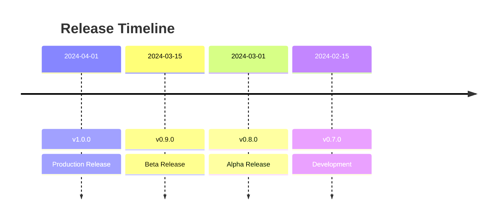

# Reference Documentation

## Navigation

- [← Back to Main](../README.md)
- [↑ Up to Index](./index.md)
- [→ Next: Changelog](./changelog.md)

## Contents

1. [Changelog](./changelog.md)
   - Version History
   - Breaking Changes
   - Migration Guides
   - Future Plans

2. [Contributing](./contributing.md)
   - Development Workflow
   - Code Standards
   - Pull Requests
   - Code Review

3. [License](./license.md)
   - Terms
   - Permissions
   - Limitations
   - Third-party Licenses

4. [Support](./support.md)
   - Contact Information
   - Issue Reporting
   - Feature Requests
   - Community Resources

## Version Information

### Current Version

```json
{
  "version": "1.0.0",
  "releaseDate": "2024-04-01",
  "compatibility": {
    "node": ">=18.x",
    "npm": ">=8.x"
  }
}
```

### Version History



## Contributing Guidelines

### Code Standards

```typescript
// Example of code standards
interface ComponentProps {
  data: DataType;
  onUpdate: (data: DataType) => Promise<void>;
  isLoading?: boolean;
}

const Component: React.FC<ComponentProps> = ({
  data,
  onUpdate,
  isLoading = false
}) => {
  // Implementation
};
```

### Git Workflow

```bash
# Feature development workflow
git checkout -b feature/new-feature
git add .
git commit -m "feat: add new feature"
git push origin feature/new-feature
```

## License Information

### Usage Terms

```typescript
/**
 * @license
 * Copyright (c) 2024 Your Company Name
 * This software is proprietary and confidential.
 * Unauthorized copying is strictly prohibited.
 */
```

## Support Channels

### Official Support

- Email: support@company.com
- Hours: 9:00 AM - 5:00 PM EST
- Response Time: 24-48 hours

### Community Support

- GitHub Discussions
- Stack Overflow
- Discord Community
- Developer Forums

## Quick Links

- [Latest Release](./changelog.md#latest)
- [Contributing Guide](./contributing.md)
- [Support Options](./support.md)

## Additional Resources

### Documentation

- [API Reference](../api/overview.md)
- [Architecture Guide](../architecture/overview.md)
- [Security Guidelines](../security/overview.md)

### Tools and Utilities

- [Development Tools](../guides/development.md#tools)
- [Debugging Tools](../guides/troubleshooting.md#tools)
- [Monitoring Tools](../maintenance/monitoring.md#tools)

## Need Help?

- [FAQ](./support.md#faq)
- [Known Issues](./changelog.md#known-issues)
- [Support Contact](./support.md#contact) 