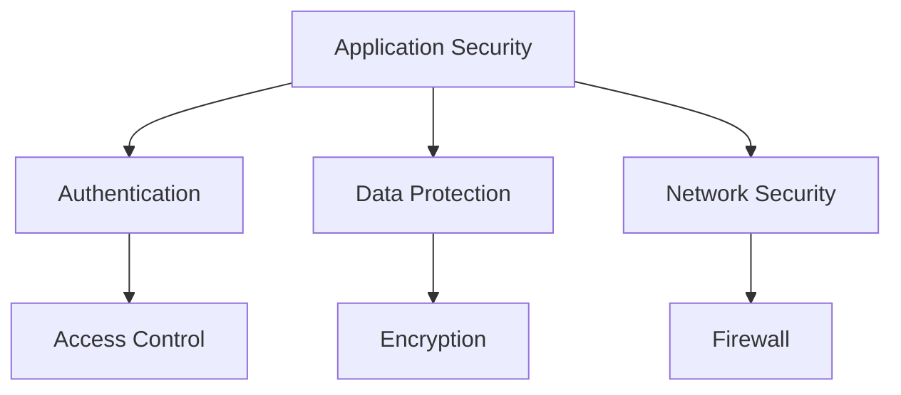

# Security Documentation

## Navigation

- [← Back to Main](../README.md)
- [↑ Up to Index](./index.md)
- [→ Next: Authentication Security](./authentication.md)

## Contents

1. [Security Overview](./overview.md)
   - Security Principles
   - Threat Model
   - Security Architecture
   - Compliance Requirements

2. [Authentication Security](./authentication.md)
   - Authentication Methods
   - Password Security
   - Session Management
   - Multi-Factor Authentication

3. [Data Protection](./data-protection.md)
   - Encryption
   - Data Privacy
   - Secure Storage
   - Data Transmission

4. [Best Practices](./best-practices.md)
   - Secure Coding
   - Security Testing
   - Incident Response
   - Security Monitoring

## Security Framework

### Security Layers



## Implementation Guidelines

### Authentication Security

```typescript
// Secure password hashing
const hashPassword = async (password: string): Promise<string> => {
  const salt = await bcrypt.genSalt(12);
  return bcrypt.hash(password, salt);
};

// Secure token generation
const generateToken = (user: User): string => {
  return jwt.sign(
    { id: user.id },
    process.env.JWT_SECRET,
    { expiresIn: '15m' }
  );
};
```

### Data Protection

```typescript
// Data encryption
const encryptData = async (data: any): Promise<EncryptedData> => {
  const key = await getEncryptionKey();
  return encrypt(data, key);
};

// Secure data transmission
const secureTransmit = async (data: any): Promise<void> => {
  const encrypted = await encryptData(data);
  await sendOverSecureChannel(encrypted);
};
```

## Security Checklist

### Application Security
- [ ] Input validation
- [ ] Output encoding
- [ ] Authentication
- [ ] Authorization
- [ ] Session management
- [ ] Error handling
- [ ] Logging
- [ ] Data protection

### Infrastructure Security
- [ ] Firewall configuration
- [ ] Network segmentation
- [ ] SSL/TLS setup
- [ ] Security updates
- [ ] Backup systems
- [ ] Monitoring
- [ ] Incident response

## Security Tools

### Development Tools
```json
{
  "security": {
    "helmet": "^6.0.0",
    "jsonwebtoken": "^9.0.0",
    "bcrypt": "^5.1.0",
    "crypto": "^1.0.1"
  }
}
```

### Monitoring Tools
- Security Information and Event Management (SIEM)
- Intrusion Detection System (IDS)
- Log Analysis
- Vulnerability Scanner

## Quick Links

- [Security Overview](./overview.md)
- [API Security](../api/overview.md#security)
- [Deployment Security](../guides/deployment.md#security)

## Need Help?

- [Security Issues](../guides/troubleshooting.md#security-issues)
- [Emergency Contact](../reference/support.md#security-contact)
- [Security Updates](../reference/changelog.md#security-updates) 